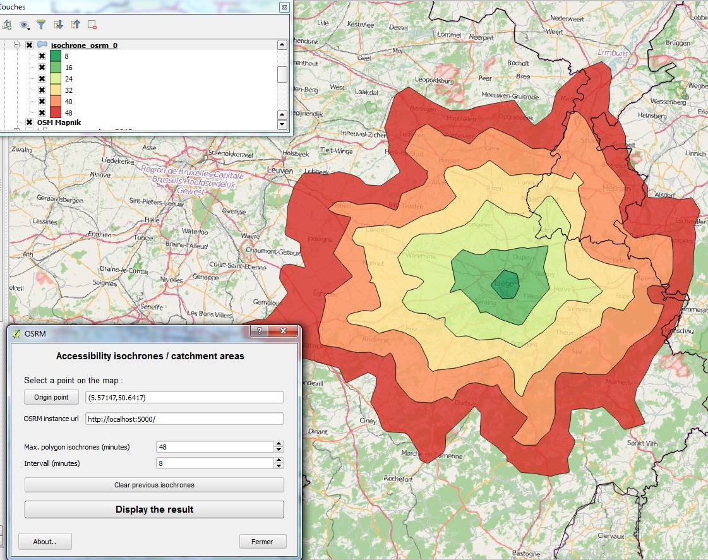

**OSRM plugin for QGIS**

Overview
========
Tiny QGIS plug-in allowing to retrieve and display data from an (ideally locally based) `OSRM`_ web service.

This plug-in is in its early stage of development and the code is hosted `on github`_.

Current version : 0.0.1

Functionality 
=============
- Find a route
- Get a time matrix
- Make accessibility isochrones
- Compute and export many routes

Usage
=====
This plug-in is primarily aimed to be used on a local instance of OSRM.

If used to request the public API you have to adhere to the `API Usage Policy`_ (which include no heavy usage, like computing many routes with the "Export many routes" functionnality of this plugin )

Example
=======
**Draw a simple route** :

.. image:: help/source/img/route.jpg
   :scale: 10 %
   :alt: route illustration
   :align: center

**Get a time matrix from a QGIS point layer** :

.. image:: help/source/img/table.jpg
   :scale: 10 %
   :alt: isochrone illustration
   :align: center

**Compute accessibility isochrones** : 

**Retrieve many routes from two QGIS layer of points**:

.. image:: help/source/img/many_routes.jpg
   :scale: 10 %
   :alt: isochrone illustration
   :align: center

Changelog
=========
0.0.1:
	- First release
0.0.1-rc1:
	- Drop the use of shapely for isochrone polygons construction.
	- ADD: a backport of functools.lru_cache to cache http request on client side.
	- ADD: restriction on the batch viaroute to prevent a massive use of the public API.

.. _API Usage Policy: https://github.com/Project-OSRM/osrm-backend/wiki/Api-usage-policy
.. _OSRM: http://project-osrm.org/
.. _on github: https://mthh.github.com/osrm-qgis-plugin/

