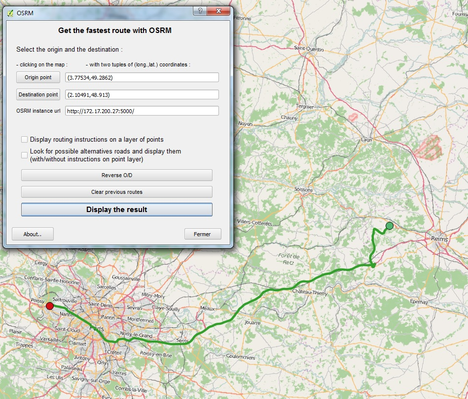
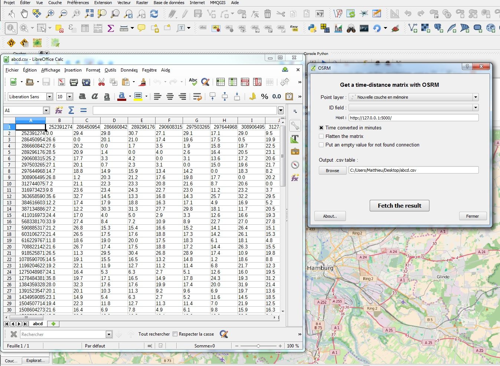
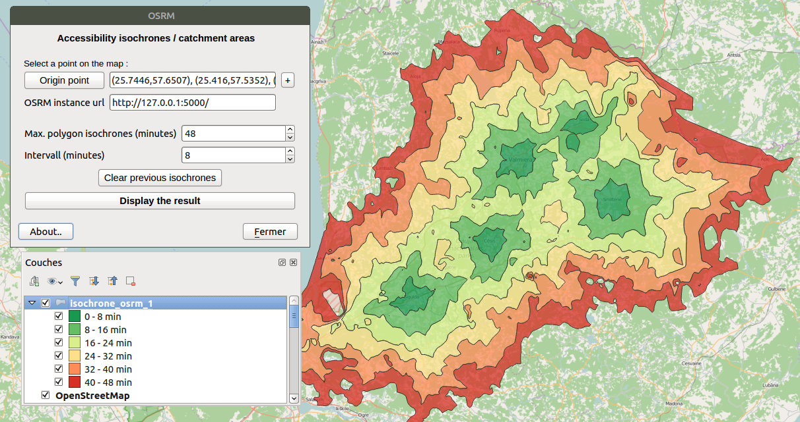
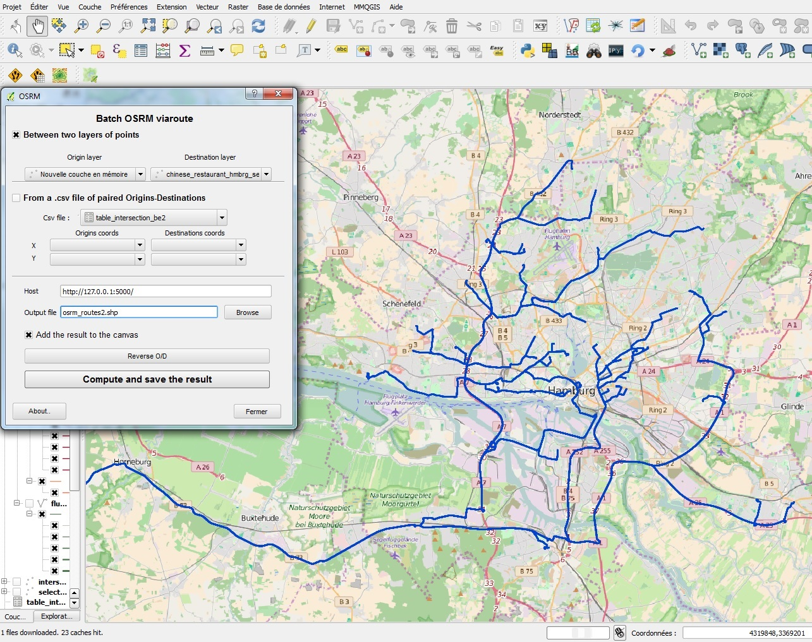
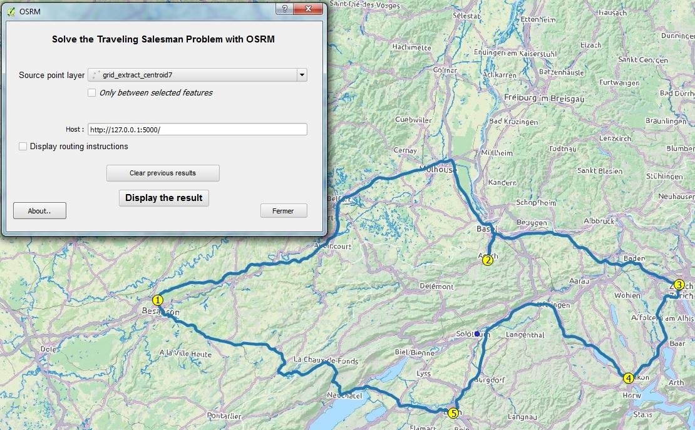

.. OSRM documentation master file, created by
   sphinx-quickstart on Sun Feb 12 17:11:03 2012.
   You can adapt this file completely to your liking, but it should at least
   contain the root `toctree` directive.

Welcome to OSRM's documentation!
============================================

Contents:

.. toctree::
   :maxdepth: 2

Indices and tables
==================

* :ref:`genindex`
* :ref:`modindex`
* :ref:`search`

Overview
========
Tiny QGIS plug-in allowing to retrieve and display data from an (ideally locally based) `OSRM`_ web service.

This plug-in is in its early stage of development and the code is hosted `on github`_.

Current version : 0.0.1

Functionality 
=============
- Find a route
- Get a time matrix
- Make accessibility isochrones
- Solve the Travelling Salesman Problem
- Compute and export many routes

Usage
=====
This plug-in is primarily aimed to be used on a local instance of OSRM.

If used to request the public API you have to adhere to the `API Usage Policy`_ (which include no heavy usage, like computing many `/viaroute` with this plug-in)

Example
=======
Images of this page are displayed on OpenStreetMap tiles (© OpenStreetMap contributors) and route computations were done with Open Source Routing Machine.

Find a route
------------
**Display a simple route from OSRM (with support of viapoints, alternatives roads and route instructions)**:

Fetch a time-distance matrix
----------------------------
**Get a time matrix from one (or between two) QGIS point layer(s)**:

Compute accessibility isochrones
--------------------------------
**Compute monocentric or polycentric accessibility isochrones**: 

Compute many *viaroute*
-----------------------
**Retrieve many routes between two QGIS layer of points**:

Display the solution of the Travelling Salesman Problem
-------------------------------------------------------
**Display the result of the Travelling Salesman Problem computed by OSRM**:

Licence and attribution
=======================
If the information computed by this plugin is intend to be reused, you have to properly display the source of the routes and the data licence attribution :

- All the routes/time matrix displayed are computed by the underlying routing engine `OSRM`_.
- Route computed by the OSRM public API (and probably by your instance) rely on `OpenStreetMap`_ dataset which is under `ODbL`_.

Changelog
=========
Latest:
	- Add support for the OSRM `/trip` functionality
	- Add support for intermediate points in viaroute displaying.
	- Add experimental support for "polycentric" (and more precise) accessibility isochrones.
	- Add support for new OSRM rectangular matrix (and isochrones creation using it).
0.0.1:
	- First release
0.0.1-rc1:
	- Drop the use of shapely for isochrone polygons construction.
	- ADD: a backport of functools.lru_cache to cache http request on client side.
	- ADD: restriction on the batch viaroute to prevent a massive use of the public API.

.. _API Usage Policy: https://github.com/Project-OSRM/osrm-backend/wiki/Api-usage-policy
.. _OSRM: http://project-osrm.org/
.. _on github: https://mthh.github.com/osrm-qgis-plugin/
.. _OpenStreetMap: http://www.openstreetmap.org/about
.. _ODbL: http://www.openstreetmap.org/copyright
.. _QGIS: http://www.qgis.org